# Tutorial: Configurando um projeto

Para o desenvolvimento das atividades da disciplina, usaremos as seguintes ferramentas:

- Visual Studio Code (VSCode) como editor de textos com as seguintes extensões:
    - Python
    - Django
- Python
- Framework Django
- Git para versionamento
    - Github como repositório remoto

Esse tutorial considera que essas ferramentas já estão instaladas no computador.

## Começando um projeto do zero

Após abrir o VSCode vá no botão `Open Folder` (*File/Open Folder*) e crie uma nova pasta para o seu projeto.

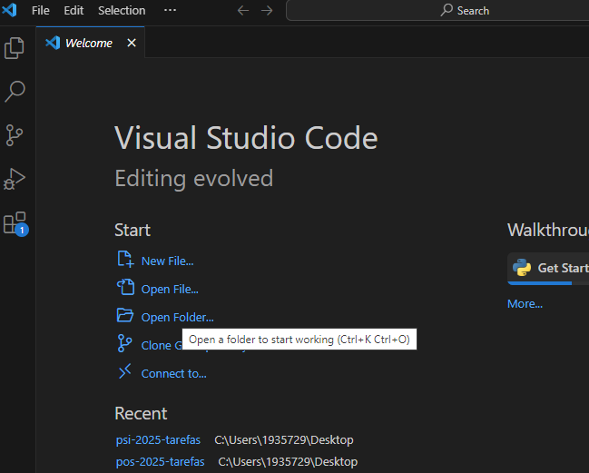

Confirme na janela que você confia no autores da pasta.

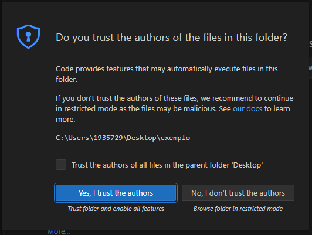

## Ambiente Virtual Python (*venv*)

Abra um terminal (*Terminal/New terminal*) e inicialize um ambiente virtual Python chamado `venv`:

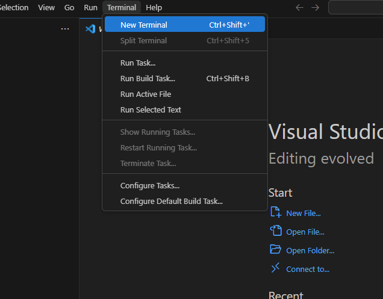


```sh
python -m venv venv
```

Para utilizar o ambiente é necessário ativá-lo.

```sh
./venv/Scripts/Activate.ps1
```

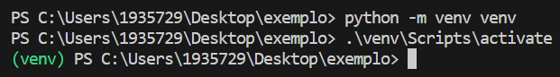

!!! warning "Atenção!"
    Lembre de utilizar a tecla Tab no teclado para auto-completar os comandos e evitar erros de digitação.

O VSCode normalmente identifica e pergunta se você quer usar o *venv* que foi criado, e você deve aceitar.

O *venv* precisa estar ativo no terminal para os comandos e também no editor para que ele reconheça as bibliotecas e não fique acusando erros inexistentes. Com um arquivo `.py` aberto, verifique no canto inferior direito da tela se aparece o Python com o indicador de *venv*. Caso não apareça, clique no nome Python e selecione o seu *venv* na lista que vai aparecer.


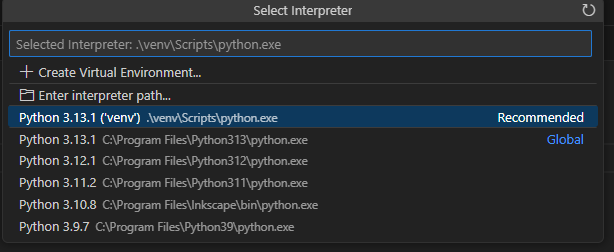

## Arquivo de dependências (*requirements*)

Com o *venv* inicializado e ativo, podemos instalar algum pacote necessário usando o *pip*. Esses pacotes ficarão instalados automaticamente dentro da pasta `/venv`. Usaremos como **exemplo** o pacote `cowsay`.

```sh
pip install cowsay
```

Como o *venv* não será reutilizado em outros computadores, guardamos a lista dos pacotes instalados em um arquivo para que possam ser instalados novamente quando necessário. Esse arquivo de dependências de projeto é nomeado `requirements.txt` por padrão.

Usando o comando `pip freeze`, que imprime a lista dos pacotes instalados e suas versões podemos criar o arquivo `requirements.txt` automaticamente:

```sh
pip freeze > requirements.txt
```

É importante lembrar de executar esse comando sempre que um novo pacote que deva fazer parte do projeto for instalado.

O operador `>` é chamado de redirecionamento de saída, e sua função é redirecionar o que o comando do lado esquerdo escreveria no terminal para dentro de um arquivo. Se for executado novamente ele sobrescreve o arquivo.

Existe também a versão `>>` que adiciona ao final do arquivo original, sem apagar o que já estava lá.

## Testando o funcionamento

Crie um arquivo `teste.py` com o seguinte conteúdo:

```python
import cowsay

cowsay.cow("Hello, world!")
```

Execute esse arquivo no terminal com o comando:

```sh
python teste.py
```

Verifique o que acontece. Caso não funcione, reveja os passos anteriores para garantir que tudo foi realizado corretamente.

## Configurando o Git

Primeiramente, se não tiver, crie uma conta no [GitHub](https://github.com). Use seu email pessoal (não perca a senha!) e crie um *username* adequado, que possa ser utilizado em situações profissionais no futuro.

Para utilizar o Git pela primeira vez em um computador específico, é necessário configurar o  nome e email localmente. Essas informações são utilizadas na mensagem de *commit*, por isso, use seu nome usual e o email cadastrado no GitHub.

A opção `--global` indica que esses valores serão utilizados em todos os projetos do usuário logado. Sem ela a configuração vale apenas para o projeto atual.

```sh
git config --global user.name "Seu Nome"
git config --global user.email "seuemail@servidor.com"
```

## Inicializando o repositório

Todo o gerenciamento de repositório do VSCode fica no lado esquerdo, na seção "*Source Control*". Podemos inicializar o repositório por lá, ou diretamente no terminal com:

```sh
git init
```

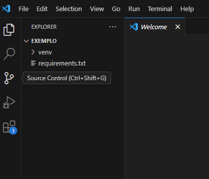

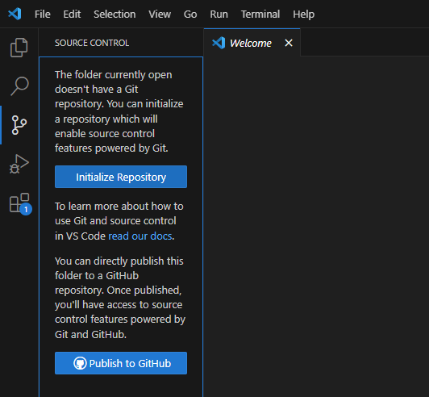

## Gitignore

Existe um arquivo muito importante para o repositório que é o `.gitgnore`. Como é padrão em sistemas Posix (família do Unix, Linux, MacOS, etc.), arquivos que iniciam com ponto (`.`) são arquivos *ocultos*, e não aparecem normalmente na listagem de arquivos.

Esse arquivo define os arquivos que **não podem** entrar no repositório, como arquivos com senhas, arquivos temporários, arquivos do ambiente de desenvolvimento e arquivos irrelevantes no geral.

Quando iniciamos um repositório, devemos definir um `.gitignore` com os arquivos que não podem entrar no repositório.

O maior exemplo disso agora é o *venv*. Também é importante ignorar as pastas `__pycache__` que são arquivos temporários que o Python gera.

Crie um arquivo com o nome `.gitignore` e o seguinte conteúdo:

```
venv
__pycache__
```

Para ignorar mais arquivos/pastas, basta ir adicionando seus nomes, linha a linha.

!!! warning "Importante!"
    Recentemente o *venv* passou a incluir um `.gitignore` interno automaticamente, porém é importante garantir que nosso `.gitignore` do projeto ignore a pasta `venv`, pois é possível que seu projeto seja executado em um computador com uma versão antiga.

    Nunca adicione ambientes de desenvolvimento no repositório!

## Verificando status do repositório

No terminal utilizamos o comando `git status`. Já na interface gráfica vemos na aba *Source Control*.

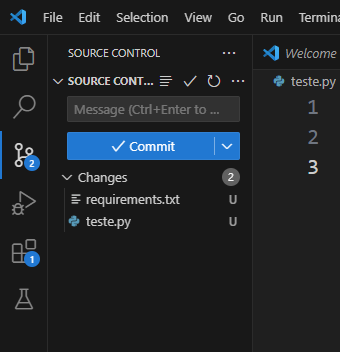

O status `U` significa que o arquivo não faz parte do repositório ainda.

## Adicionando arquivos ao repositório

Seguindo a lógica do *git*, devemos primeiro adicionar os arquivos a área de *staging*, e aí sim podemos realizar o *commit* com uma mensagem, que vai realmente adicionar aquela versão do arquivo ao nosso repositório.

No VSCode é possível realizar isso diretamente na interface gráfica ou pelo terminal.

```sh
git add .gitignore
git add requirements.txt teste.py
git commit -m "Mensagem que descreve o que você fez"
```

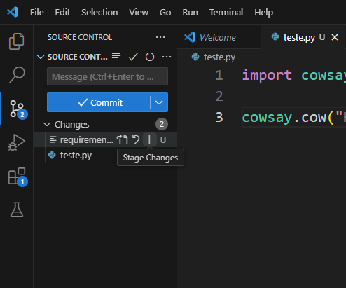

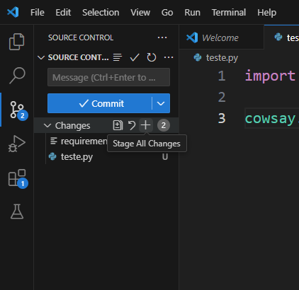

Depois de adicionados, o status muda para `A` e podemos fazer o commit.

!!! warning "Importante!"
    A mensagem de *commit* é obrigatória! Caso você esqueça de colocar, e clique em *Commit*, uma janela do editor abrirá para que você adicione a mensagem. Escreva a mensagem, salve e feche o arquivo para poder continuar.

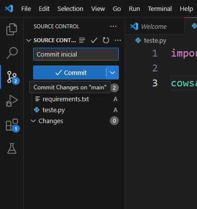

## Enviando as alterações para o GitHub

Quando já temos os arquivos *commitados*, podemos enviar nossas alterações para o repositório no GitHub. 
A partir do repositório remoto é possível *clonar* o projeto em outro computadores e continuar nosso trabalho, além de ser uma forma de *backup* para que nada se perca.

Primeiramente é necessário criar o repositório remoto.

Clique no botão *Create* ou *New* na sua página do GitHub.

Defina um nome para o repositório. No caso desse tutorial use `tutorial01`.

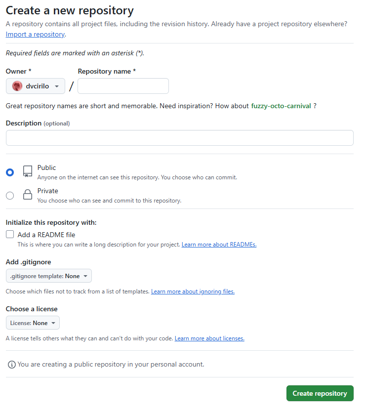

O Github oferece a possibilidade de criação de alguns arquivos padrão, como o `README.md`, usado para escrever informações sobre o projeto e o `.gitignore`, que evita que arquivos indesejados entrem no nosso repositório. Como nosso projeto já tem *commits*, não vamos utilizar essas opções, pois causaria conflitos. Também não defina uma licença.

Após criar o repositório, o Github dá as informações de como configurar o repositório local (no git) para se comunicar com o repositório remoto (no Github)

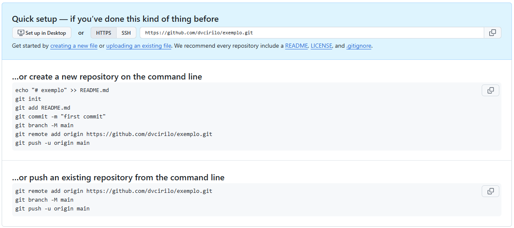

Seguiremos as instruções em *Existing local repository*, que é o nosso caso. O GitHub nos dá 3 comandos, que devemos executar linha por linha no terminal. 

```sh
git remote add origin https://github.com/seuusuario/tutorial01.git
git branch -m main
git push -u origin main
```

A primeira linha adiciona o endereço do nosso repositório no Github como repositório remoto e com o nome `origin`, já que ele vai ser a origem central do projeto.

!!! warning "Atenção!"
    Quando seguir o tutorial, atente para os nomes que devem ser modificados, por exemplo `seuusuario` deve ser substituído pelo seu *username* no GitHub.

O segundo comando renomeia o nosso *branch* principal de `master` para `main`, que a convenção mais utilizada atualmente e o padrão do GitHub.

E por último, o comando `git push` *empurra* o nosso código para o repositório remoto (`origin`) no *branch* `main`.
A opção `-u` serve para relacionar o *branch* remoto `main` com nosso *branch* local `main`. Só é necessário fazer isso na primeira vez que fizer *push* de um *branch*.

No primeiro envio, o Github vai precisar autenticar sua conta, aparecerá a seguinte janela, que você deve clicar em "Sign in with your browser"

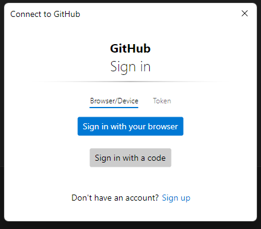

Insira seus dados de login e aceite o acesso:

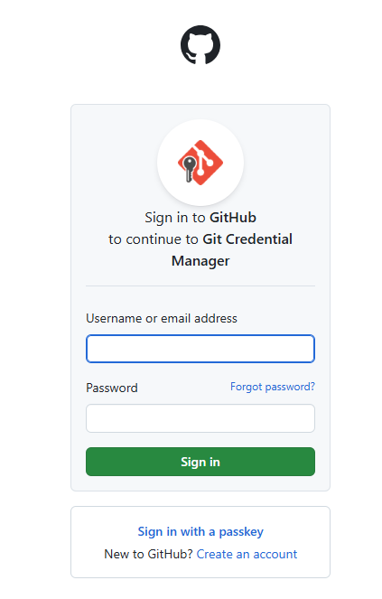

No final do processo aparecerá uma página de erro, mas a autenticação já deu certo.


Acesse a página do repositório para verificar.

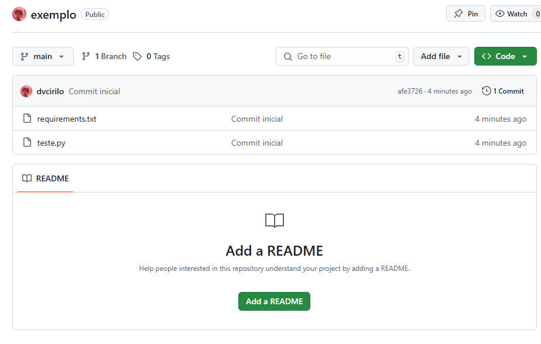

A partir de agora todas as modificações podem seguir a sequência:

1. Faço as alterações, crio arquivos, etc;
1. Adiciono cada arquivo com `git add arquivo1 arquivo2 etc`;
1. Faço o *commit* com `git commit -m "mensagem de commit"`;
1. Faço o *push* com `git push`;
1. Volto para o primeiro passo.

# Para utilizar um projeto já existente

Uma das principais vantagens de se usar o Git com GitHub é poder sincronizar os projetos pela internet, e assim trabalhar em diversos computadores ou com diversas pessoas sem se preocupar com essa troca de arquivos.

## Clone o repositório remoto

Quando chegamos em outro computador, ou vamos trabalhar em um projeto iniciado por outra pessoa, devemos realizar o *clone* do repositório.
Na página do projeto no GitHub, é possível obter o link para clonar, que segue o padrão `https://github.com/nome-do-usuario/nome-do-repositorio.git`.

Quando abrimos o VSCode sem nenhuma pasta aberta (ou fechamos a pasta que estava aberta), podemos ver na página inicial a opção de *Clone GitHub repository*.

Também é possível achar essa opção em *File/Clone GitHub repository*.

Quando clicamos, ele pede o link, que é exatamente o que achamos na página do projeto. 

Ele pede que seja escolhido o lugar onde esse projeto será colocado.

Uma outra opção é abrir um terminal, ir para a pasta onde queremos clonar o repositório e digitar:

```sh
git clone https://github.com/nomedodono/nomedorepositorio.git
```

## Criar o venv

No repositório clonado não teremos o *venv* ainda, pois ele não deve ser reutilizado em máquinas diferentes, e muito menos ser enviado para o GitHub. Por isso que usamos um arquivo `.gitignore`.

Recriamos o *venv* com:
```sh
python -m venv venv
```

E na sequência já ativamos.

```sh
./venv/Scripts/Activate.ps1
```

Esse *venv* ainda está vazio, então devemos reinstalar os pacotes a partir do arquivo `requirements.txt` usando o comando:

```sh
pip install -r requirements.txt
```

Agora estamos com o ambiente montado novamente e podemos continuar o trabalho.

## Sincronizar mudanças

Como esse já é o segundo local que estamos usando esse projeto, é importante garantir que ele esteja sincronizado sempre que formos começar a trabalhar, especialmente se há mais de uma pessoa trabalhando no mesmo *branch*.

Devemos fazer o `git pull` para *puxar* as modificações do repositório remoto para nosso repositório local.

Por exemplo, você trabalhou hoje no laboratório A214 e enviou o projeto para o GitHub. No dia seguinte você fez o *clone*, trabalhou no laboratório A203 e fez o *push* (enviou) no final. Quando voltar ao mesmo computador no A214 em outro dia, deverá sincronizar essas mudanças que ainda não estão lá.

No terminal fazemos:

```sh
git pull
```

É muito importante fazer *pull* antes do *push*, pois se houver algum conflito, ele acontecerá localmente sem atrapalhar o código original no GitHub.
