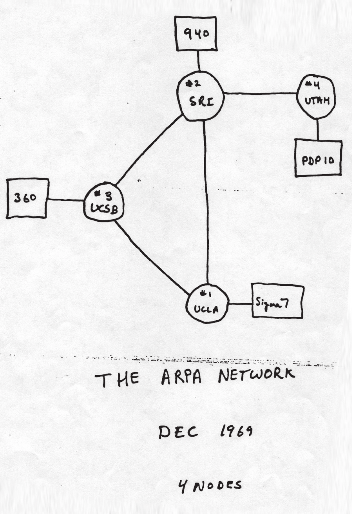
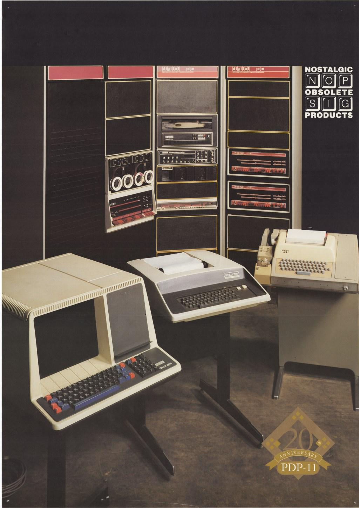
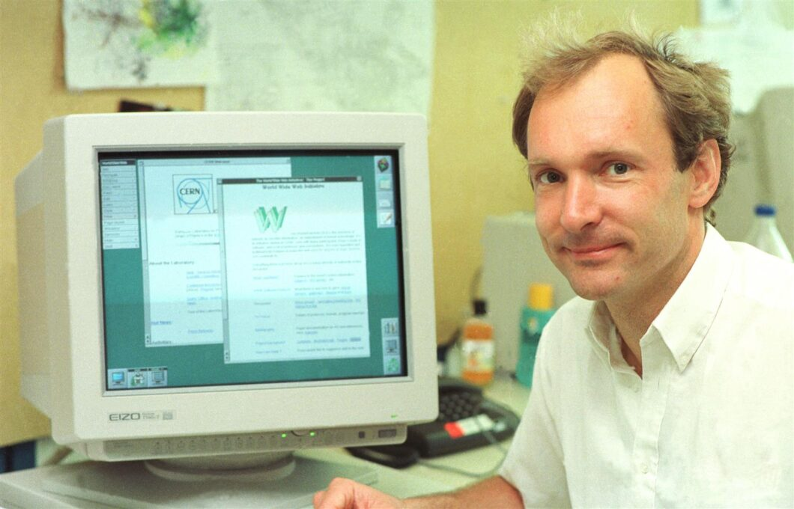
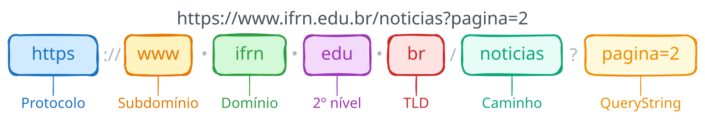
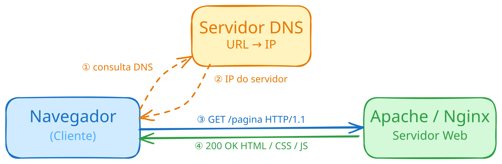
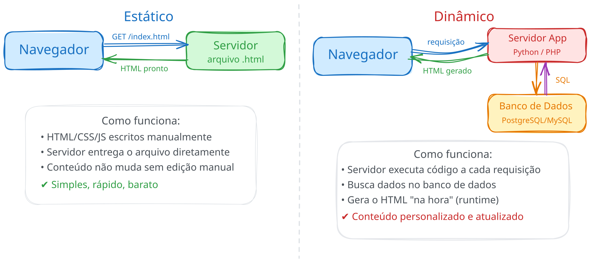

# <!-- fit --> Programação de Aplicação Web

### Prof. Diego Cirilo

**Aula 02**: Conceitos Básicos

---
# Internet
- Programação de Aplicação **Web**;
- *Rede mundial de computadores*;
- Base de praticamente todos os serviços digitais modernos: comunicação, comércio, entretenimento, educação;
- Dá pra viver sem?

---
# Histórico
- A internet começou a ser criada com o projeto do governo americano chamado **ARPANET**;
- *Advanced Research Projects Agency*;
- Tinha o objetivo de interligar Universidades e Instituições de pesquisa e militares;
- Anos 60;

---
# Histórico

---

# Histórico
- Em 1980 várias outras universidades foram incorporadas;
- Em 1985 a NSF (*National Science Foundation*) interligou seus computadores em rede;
- Em 1986 a NSF se junta à ARPANET e essa rede passa a ser chamada de *Internet*;
- Em 1989 a FAPESP (Fundação de Amparo à Pesquisa do Estado de São Paulo) e a LNCC (Laboratório Nacional de Computação Científica) se ligam a Internet;
- No mesmo ano foi criada a [RNP (Rede Nacional de Pesquisa)](https://www.rnp.br/sobre-nos/nossa-historia/);
- [Mapa RNP](https://redeipe.rnp.br/panorama).

---

# Histórico
- Em 1991 o cientista Tim Berners-Lee do CERN cria o WWW (*World Wide Web*);
    - Antes só existia email, FTP e Telnet;
- Depois do WWW foi criado o Mosaic, o primeiro navegador para *web* que renderizava imagens;
- Em 1993 a internet é aberta para exploração comercial nos EUA, e o mesmo ocorre um ano depois no Brasil.

---
# WWW
- Sistema de informação que utiliza a internet como meio de transmissão;
- Páginas de multimídia interligadas através de *hyperlinks*;
- Arquitetura Cliente/Servidor.

---

# Conceitos do WWW
- Conceitos:
    - HTTP - Protocolo de transferência de hipertexto (*Hypertext Transfer Protocol*):
        - Realiza a comunicação com um servidor Web através de requisições e respostas bem definidas.
    - URL - Sistema de endereços:
        - `http://www.ifrn.edu.br/`;
    - HTML - Linguagem de marcação de hipertexto (*Hypertext Markup Language*):
        - *Hyper* = documentos interligados por *links*;
        - Formatação para texto, inserção de imagens e *links*.

---

# URL
- *Uniform Resource Locator*
- Protocolo/Domínio/Recurso — Ex. *www.ifrn.edu.br*
- Lido da **direita para a esquerda**:
    - **TLD** (*Top-Level Domain*): `.br` — país; `.com`/`.org` — internacional
    - **2º nível**: tipo de instituição. Ex. `.edu`, `.com`, `.gov`
    - **Domínio**: nome do site. Ex. `ifrn`
    - **Subdomínio**: serviço. Ex. `www`, `mail`, `suap`

---
# URL

- https://github.com/dvcirilo/psi-ifrn
- https://www.youtube.com/watch?v=GggUi3KQpLc
- https://suap.ifrn.edu.br
- https://g1.globo.com/rn

---

# Protocolo TCP/IP
- *Transmission Control Protocol/Internet Protocol*;
- Conjunto de regras e padrões que permitem a comunicação entre computadores na rede;
- Pode ser organizado em quatro camadas:
    - **Enlace**: controla o hardware e o meio de comunicação. Ex.: Ethernet, Wi-Fi;
    - **Internet**: encontra o melhor caminho através da rede. Ex.: IP;
    - **Transporte**: comunicação confiável entre dispositivos e correção de erros. Ex.: TCP, UDP;
    - **Aplicação**: protocolos de comunicação entre serviços. Ex.: HTTP, FTP, SMTP.
- O escopo dessa disciplina é a camada de aplicação.

---
# IP
- O IP (*Internet Protocol*) é responsável pelo encaminhamento de dados entre as máquinas na rede;
- As máquinas são identificadas por um endereço IP, ex: 122.220.98.4;
- Além do IP também existem *portas*, que podem ser acessadas por diferentes serviços;
- As portas são representadas com `:` após o IP, ex. `127.0.0.1:2046`.

---
# DNS
- DNS (*Domain Name System*) é responsável por traduzir URLs em endereços IP;
- É mais fácil lembrar `www.ifrn.edu.br` do que `200.129.2.180`;
- Funciona de forma hierárquica e distribuída — vários servidores DNS ao redor do mundo;
- Para registrar um domínio é necessário pagar para um *registrar*. Ex. GoDaddy, Registro.br

---
# Navegador
- Também chamado de *browser*:
    - Aplicativo responsável pelo acesso às páginas web;
    - Transforma/*Renderiza* códigos HTML/JS/CSS em páginas interativas;
    - Ex. Google Chrome, Microsoft Edge, Mozilla Firefox, Opera, Brave, Chromium...
- Faz requisições HTTP/HTTPS e renderiza os dados recebidos;
- É o cliente.

---
# Resumo (simplificado)

---

# Protocolo HTTP

- *HyperText Transfer Protocol*
- Camada de aplicação
- Baseado no modelo cliente-servidor
- Padrão de mensagens de requisição e respostas
- Porta 80 (ou 443 para HTTPS)
- Cada mensagem é composta por **Método** / **Cabeçalho** / **Corpo**
    - *Corpo*: dados enviados na requisição (ex.: formulário, JSON) ou na resposta (ex.: HTML, imagem)
- [Referência](https://developer.mozilla.org/pt-BR/docs/Web/HTTP/Overview)

---

# Métodos HTTP

| Método  | Descrição                                  |
| ------- | ------                                     |
| GET     | Recebe um recurso existente                |
| POST    | Cria um novo recurso                       |
| PUT     | Atualiza um recurso existente              |
| PATCH   | Atualiza parcialmente um recurso existente |
| DELETE  | Remove um recurso                          |

---
# Códigos de status

| Faixa   | Categoria        |
| ------- | ------           |
| 2xx     | Sucesso          |
| 3xx     | Redirecionamento |
| 4xx     | Erro de cliente  |
| 5xx     | Erro de servidor |

---
# Códigos de status

| Código | Significado                | Descrição                                                                      |
|--------|----------------------------|--------------------------------------------------------------------------------|
| 200    | OK                         | A requisição foi bem-sucedida.                                                 |
| 201    | Created                    | Um novo recurso foi criado.                                                    |
| 202    | Accepted                   | Requisição recebida, ainda não processada.                                     |
| 204    | No Content                 | Requisição bem-sucedida, sem conteúdo na resposta.                             |
| 400    | Bad Request                | Requisição malformada ou inválida.                                             |
| 401    | Unauthorized               | Cliente não autenticado.                                                       |
| 404    | Not Found                  | Recurso não encontrado.                                                        |
| 415    | Unsupported Media Type     | Formato de dados não suportado pelo servidor.                                  |
| 422    | Unprocessable Entity       | Dados válidos no formato, mas com erros de conteúdo.                           |
| 500    | Internal Server Error      | Erro interno no servidor.                                                      |

---
# Cabeçalho HTTP

| Dado           | Descrição                                                        |
| ---            | ---                                                              |
| Accept         | O tipo de conteúdo que o cliente aceita                          |
| Content-Type   | O tipo de conteúdo que o servidor retorna                        |
| User-Agent     | Que software o cliente está usando para comunicar com o servidor |
| Server         | Que software o servidor usa para comunicar com o cliente         |
| Authorization  | Quem chama a API e quais suas credenciais                        |

---

# <!-- fit --> Programação de Aplicação Web

---
# Sites Estáticos
- Primeiro tipo de site existente;
- O que foi feito nas disciplinas anteriores;
- O conteúdo do site é definido no momento da escrita do HTML;
- O usuário não é capaz de armazenar/modificar dados no sistema;
- É o suficiente?

---
# Sites Dinâmicos
- A página é construída em `tempo de execução`;
- O conteúdo pode estar armazenado em um banco de dados;
- Permitem a apresentação de dados e funcionalidades mais complexas;
- O processamento é realizado no servidor;
- "Web 2.0": geração de sites colaborativos e interativos (YouTube, Wikipedia, redes sociais);
- Exemplos?

---
# Sites Estáticos vs. Dinâmicos

---

# Sites Dinâmicos
- CGI (*Common Gateway Interface*):
    - Processamento de *forms* e acesso a banco de dados;
    - Executa um programa em uma linguagem qualquer que processa a requisição e retorna o HTML formado.
- PHP (*Personal Home Page*, depois *PHP: Hypertext Preprocessor*):
    - Permite descrever a lógica dentro de um arquivo HTML que é pré-processado pelo servidor;
    - Linguagem muito popular até hoje e inicialmente desenvolvida para *web*.

---
# Sites Dinâmicos
- Outras linguagens: ASP, Java, Ruby, **Python**, Node.js, etc;
- Frameworks: Django, Rails, Laravel, Express…
    - Nesta disciplina: **Python + Django**.

---
# Sistema Web
- **Web**: acessado pelo navegador. Ex.: Gmail, YouTube, SUAP;
- **Desktop**: instalado no sistema operacional. Ex.: Word, Photoshop, VS Code;
- **Mobile**: app no celular. Ex.: WhatsApp, Instagram.
- Vantagens/Desvantagens de cada um?

---

# Front-end e Back-end e Full-Stack
- *Front-end*: parte visual, interface com o usuário;
    - Tecnologias: HTML, CSS, JavaScript.
- *Back-end*: processamento, armazenamento de dados, segurança, páginas dinâmicas;
    - Tecnologias: PHP, Java, Python, Ruby, JavaScript, SQL, etc.
    - *JavaScript roda no navegador (front) e também no servidor via Node.js (back)*.
- *Full-stack*: tudo;
- E o Designer?
    - **UX/UI Designer**: responsável pela interface e experiência do usuário;
    - Trabalha próximo ao *front-end*, mas é uma especialidade distinta.

---
# Referências
- Dye, M. A., McDonald, R., Rufi, A. W. (2007). Network Fundamentals, CCNA Exploration Companion Guide (2nd Edition) (Companion Guide). Reino Unido: Cisco Press.
- https://developer.mozilla.org/pt-BR/docs/Web/HTTP/Overview

---
# <!--fit--> Dúvidas? 🤔
