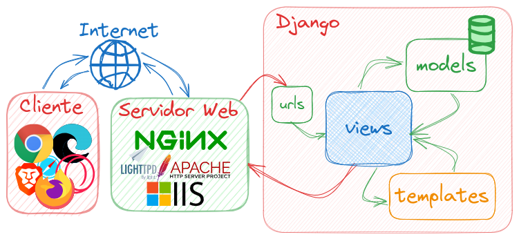

<style>
img {
  display: block;
  margin: 0 auto;
}
</style>

# <!-- fit --> Programação de Sistemas para Internet

### Prof. Diego Cirilo

**Aula 04**: Desenvolvimento Web com Python/Django

---
# Desenvolvimento de *back-end*
- Para sites dinâmicos é necessário que exista o *back-end*;
- O *back-end* recebe as requisições HTTP do cliente e retorna os dados;
- Normalmente envolve uma conexão com banco de dados.

---
# Desenvolvimento de *back-end*
- Linguagens PHP, Java, Ruby, Python, ASP, etc.;
- Seu programa recebe requisições HTTP (através de um servidor web) e responde HTTP com o conteúdo em HTML, que será renderizada pelo navegador;
- Programar tudo do zero é viável?

---
# *Framework*
- Estrutura, armação.


---
# *Framework*
- Conjunto de ferramentas e bibliotecas pré-construídas;
- Agiliza o desenvolvimento;
- Padroniza o código e a estrutura do projeto;
- Promove a reutilização de código;
- Facilita a colaboração entre desenvolvedores.

---
# *Framework*
- Exige um estudo específico da ferramenta;
- Curva de aprendizagem pode ser desafiadora;
- É importante aprender e se adequar aos padrões;
- Desempenho.

---
# Django
- *Framework* web para Python;
- Criado em 2005 e baseado no Ruby on Rails;
- Utiliza o padrão MVT (*model-view-template*);
- Objetivos gerais:
    - DRY - *Don't Repeat Yourself*;
    - Desenvolvimento rápido;
    - Menos código;
    - Baixo acoplamento.
- Sites que usam Django (não necessariamente para todos os serviços) [link](https://djangostars.com/blog/10-popular-sites-made-on-django/).

---
# MVT
- *Model*: define a estrutura dos dados (se relaciona com o BD);
- *View*: lógica de controle, recebe as requisições, carrega e filtra dados dos *Models* e retorna para o *Template*;
- *Template*: Define a visualização. Baseado em HTML com acesso a variáveis oriundas das *Views* e *tags* para condicionais, laços, etc.

---
# Django MVT


---
# Instalação
- É importante usar *venv* para projetos Django;
- Com o *venv* ativado:
```
pip install django
```

---
# Inicializando um projeto
- O Django disponibiliza a ferramenta `django-admin`;
- Para criar um projeto:
```
django-admin startproject nome-do-projeto .
```
- O `.` no final do comando informa para o `django-admin` que o projeto deve ser criado na pasta atual. Sem o ponto ele cria mais uma pasta.

---
# O projeto Django
- A pasta criada fica com a seguinte estrutura:

```
pasta-do-projeto
├── manage.py
├── nome-do-projeto
│   ├── asgi.py
│   ├── __init__.py
│   ├── settings.py
│   ├── urls.py
│   └── wsgi.py
├── venv
│   └── coisas do venv
└── requirements.txt
```

---
# O projeto Django
- `manage.py`: *script* de gerenciamento do projeto;
- `nome-do-projeto`: armazena os arquivos de configuração a seguir:
    - `__init__.py`: indica que o diretório é um pacote Pytho;
    - `asgi.py` e `wsgi.py`: utilizados para o `deploy` (rodar o sistema no servidor;
    - `settings.py`: configurações do projet;
    - `urls.py`: definições quais *Views* são chamadas por quais *rotas*/URLs.

---
# O projeto Django
- Como a pasta `nome-do-projeto` armazena os arquivos de configuração, podemos usar um nome padrão para o projeto:
    - `config`, `core`, etc.
- Na disciplina vamos **convencionar** usar `config`;
- Portanto, para criar um projeto vamos usar:
```
django-admin startproject config .
```

---
# Executando um sistema Django
- Utilizamos o *script* `manage.py`:
```
python manage.py runserver
```
- O servidor estará funcionando no terminal e o site pode ser acessado em http://127.0.0.1:8000/
- Para finalizar o servidor use Ctrl+C.

---
# Resumo
- Para instalar o Django (crie e ative um *venv* antes!!):
```
pip install django
```

- Para inicializar um projeto Django (dentro da pasta que você quer trabalhar)
```
django-admin startproject config .
```

- Para rodar o servidor de desenvolvimento:
```
python manage.py runserver
```

---
# Erros
- Sempre leia os erros que aparecerem com cuidado, normalmente eles já indicam a solução;
- Certifique-se que o `venv` está ativo;
- Para erros que indiquem que arquivos ou comandos não foram encontrados, verifique se você está rodando o comando no diretório correto;
- Use o comando `ls` no terminal para confirmar se o arquivo que você está tentando usar existe;
- Use o `Tab` no teclado para auto-completar os comandos e evitar erros de digitação.

---
<style scoped>ul { font-size: 22px; }</style>
# Tarefa 01
- Crie um *fork* do repositório das tarefas da disciplina (link no GSA);
- Clone **o seu repositório** (fork) usando o VSCode;
- Dentro desse repositório configure o *venv* de acordo com as aulas passadas;
- Crie o arquivo `.gitignore` (veja o [tutorial](https://dvcirilo-ifrn.github.io/psi/tutoriais/));
- Instale o Django;
- Crie o arquivo `requirements.txt`;
- Crie uma pasta chamada `tarefa01`;
- No terminal, entre nessa pasta com `cd tarefa01`;
- Dentro da pasta, inicialize um projeto `config`;
- Rode o servidor;
- Verifique se está funcionando no navegador.
- Adicione os arquivos, faça o commit e o push.

---
# <!--fit--> Dúvidas? 🤔
